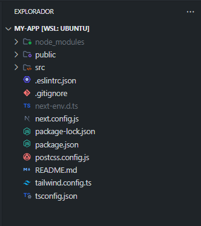

## ¿Que es Docker?

¿Alguna vez has querido llevar tu aplicación favorita a cualquier lugar? ¿O has tenido que lidiar con problemas de compatibilidad entre sistemas operativos? Si es así, Docker es la solución que estabas buscando.

Docker es una plataforma de código abierto que permite a los desarrolladores crear, ejecutar y gestionar aplicaciones de forma portable y escalable. Con Docker, puedes empaquetar tu aplicación en una caja mágica que contiene todo lo que necesita para funcionar, incluyendo el sistema operativo, las bibliotecas y los archivos de la aplicación

## ¿Cómo funciona Docker?

Imagina que tienes una aplicación web que quieres ejecutar en tu computadora. Para que la aplicación funcione, tu computadora necesita tener instalado un sistema operativo, como Windows, Linux o macOS. También necesita tener instalados los archivos de la aplicación, como el código HTML, CSS y JavaScript.

Con Docker, puedes empaquetar todos estos archivos en una caja mágica llamada **contenedor**. El contenedor contiene todo lo que la aplicación necesita para funcionar, por lo que puedes ejecutarlo en cualquier computadora que tenga Docker instalado.


## ¿Cuáles son las ventajas de Docker?

**Portabilidad**: Los contenedores son portables, lo que significa que pueden ejecutarse en cualquier computadora que tenga Docker instalado. Esto hace que sea más fácil desplegar aplicaciones en entornos de producción.

**Escalabilidad**: Los contenedores son escalables, lo que significa que puedes ejecutarlos en un solo servidor o en una granja de servidores. Esto hace que sea más fácil manejar cargas de trabajo pesadas.

**Seguridad**: Los contenedores pueden aislarse entre sí, lo que ayuda a proteger las aplicaciones de vulnerabilidades.

¡Basta de tanta charla y vamos manos a la obra!

## Requisitos previos

- Tener la ultima version instalada de [Docker Desktop](https://docs.docker.com/get-docker/).
- Tener instalado [Git](https://git-scm.com/downloads)
- Tener instalado un editor de texto, Docker recomiendo [VsCode](https://code.visualstudio.com/)

## 1 Crea un nuevo proyecto de Next.js

Puedes saltar este paso si ya tienes un proyecto de ante mano creado.
Para crear un nuevo proyecto Next.js con Docker, ejecuta el siguiente comando en tu terminal:
`npx create-next-app <my-app>` Este comando creará un nuevo proyecto Next.js con los siguientes archivos:



### Inicia el servidor de desarrollo

Para iniciar el servidor de desarrollo, abre tu línea de comandos y navega hasta la raíz del proyecto. Luego, ejecuta el siguiente comando:

```js
npm run dev
```

Ahora puedes explorar tu aplicación visitando http://localhost:3000 en tu navegador. Verás la siguiente página de inicio predeterminada de Next.js:


## 2 Dockerfile

Cree un archivo `Dockerfile` en el directorio raiz de su proyecto, con el siguiente nombre `Dockerfile`

> Un Dockerfile es un archivo de texto plano que contiene un conjunto de instrucciones y configuraciones que se utilizan para construir una imagen de Docker. Esta imagen sirve como plantilla para la creación de contenedores Docker. En otras palabras, el Dockerfile es una receta que describe cómo se debe configurar el entorno dentro del contenedor, qué archivos y dependencias se deben incluir y cómo se debe preparar la aplicación para su ejecución.

```js
# Imgae para ejecutar una aplicación Next.js

FROM node:18-alpine

WORKDIR /app

COPY package*.json ./

RUN npm install

COPY . .

EXPOSE 3000

CMD ["npm", "start"]
```

### Te explico los comandos del Dockerfile:

- **FROM node:18-alpine:** Este comando especifica la imagen base que se utilizará para crear la nueva imagen. En este caso, la imagen base es node:18-alpine, que es una imagen oficial de Docker que contiene Node.js 18 y Alpine Linux.

- **WORKDIR /app:** Este comando establece el directorio de trabajo para el resto de los comandos en el Dockerfile. En este caso, el directorio de trabajo es /app.

- **COPY `package*.json ./`** Este comando copia el archivo `package.json` del directorio actual al directorio `/app` de la imagen. El archivo `package.json` contiene información sobre las dependencias de Node.js para el proyecto.

- **RUN npm install:** Este comando ejecuta el comando `npm install` para instalar las dependencias de Node.js especificadas en el archivo `package.json`.

- **COPY . .:** Este comando copia todo el contenido del directorio actual al directorio `/app` de la imagen.

- **EXPOSE 3000:** Este comando expone el puerto 3000 del contenedor. Esto significa que el puerto 3000 estará accesible desde el exterior del contenedor cuando se ejecute.

- **CMD ["npm", "start"]:** Este comando especifica el comando que se ejecutará cuando se inicie el contenedor. En este caso, el comando que se ejecutará es `npm start`, que inicia la aplicación Next.js.

## 3 Creando tu primer contenedor Docker

Para crear tu primer contenedor Docker, sigue estos pasos:

Abre una terminal de línea de comandos y navega al directorio raíz de tu proyecto.
Ejecuta el siguiente comando:

```js
docker build -t docker_nextjs:developement .
```

Esto comenzará a construir un contenedor Docker con el nombre `docker_nextjs` y la etiqueta `development`. Puedes cambiar el nombre y la etiqueta a lo que quieras. El `.` al final del comando le dice a Docker que el Dockerfile está en el directorio actual.

El comando `docker build` leerá el Dockerfile y construirá la imagen de acuerdo con las instrucciones del archivo. Una vez que la imagen esté construida, puedes iniciar un contenedor a partir de ella usando el comando `docker run`.

## 4 Ejecutando un contenedor Docker

Hay dos formas de ejecutar una imagen de contenedor Docker: a través de la línea de comandos o a través de la GUI de Docker Desktop.

Para ejecutar un contenedor a través de la línea de comandos, sigue estos pasos:

1. Abre una terminal.
2. Ejecuta el siguiente comando:

```js
docker run --publish 3000:3000 docker_nextjs:developement
```

El indicador `--publish` expone el puerto 3000 del contenedor a la máquina anfitriona. Esto significa que puedes acceder a la aplicación en `http://localhost:3000`.

Para ejecutar un contenedor a través de la GUI de `Docker Desktop`, sigue estos pasos:

Abre Docker Desktop.

1. Haz clic en el botón Images (Imágenes).
2. Selecciona la imagen del contenedor que deseas ejecutar.
3. Haz clic en el botón Run (Ejecutar).
4. En el cuadro de diálogo Run image (Ejecutar imagen), especifica cualquier configuración adicional que desees, como la publicación de puertos o el montaje de volúmenes.
5. Haz clic en el botón Run (Ejecutar).


Espero que este articulo te pueda ayudar!.

Gracias por leer!.
